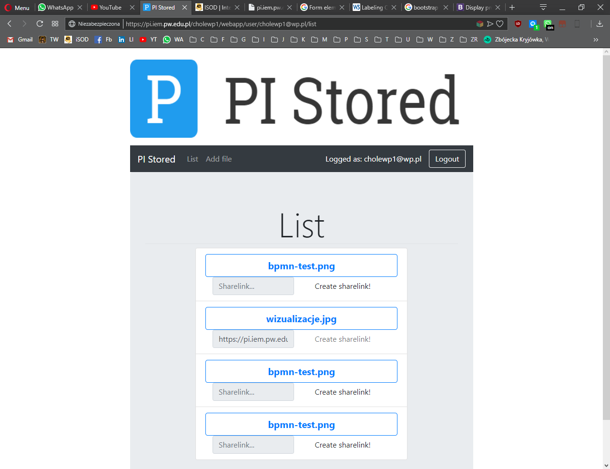
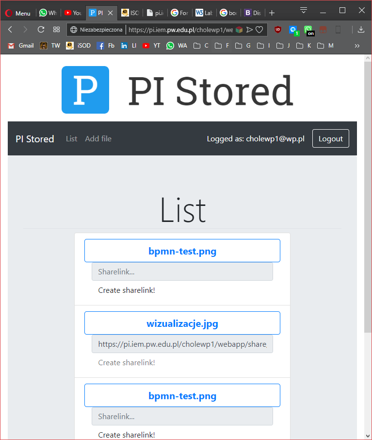
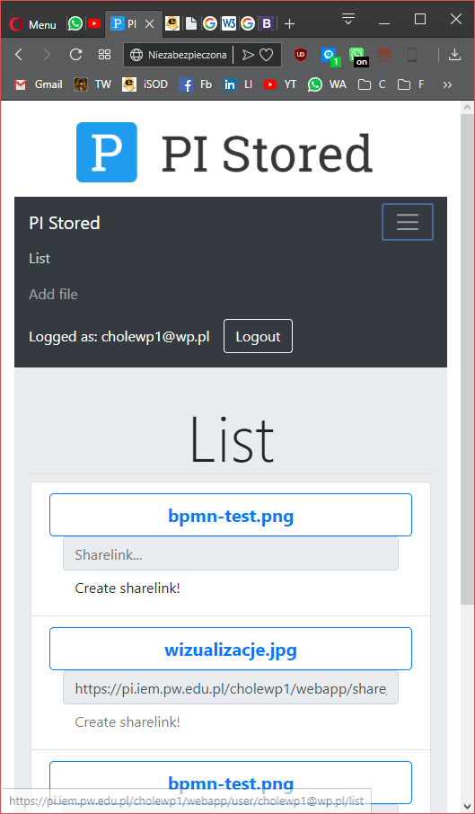
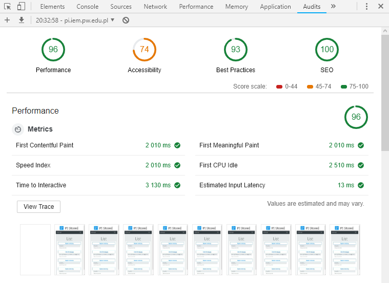
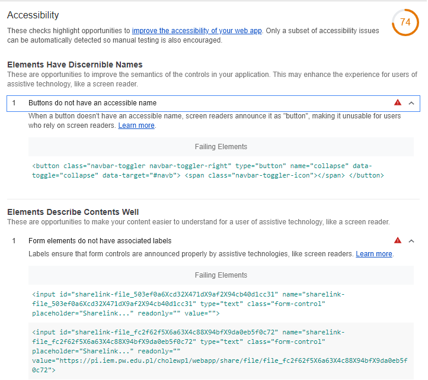
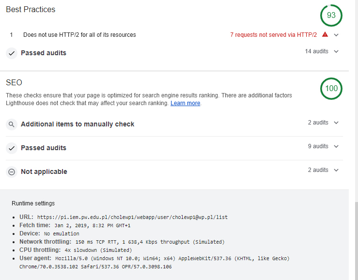

# Lab 7 
## Sprawozdanie

### 1. Wygląd aplikacji

- Widok duży aplikacji
  - Rozwinięty pasek nawigacji
  - Link udostępnienia obok przycisku generacji

- Widok średni aplikacji
	- Rozwinięty pasek nawigacji
	- Link udostępnienia nad przyciskiem generacji

- Widok mały aplikacji
	 Zwinięty pasek nawigacji do menu typu "dropdown"
	 - Link udostępnienia nad przyciskiem generacji

### 2. Audyt aplikacji

Pominąłem audyt dotyczący aplikacji progresywnych, gdyż niniejsza aplikacja opierająca się o pobieranie i wgrywanie plików z założenia nie będzie działać offline. 

Jak wynika z audytu, aplikacji brakuje tylko jednego punktu dla jednego parametru głównego do uzyskania wszędzie "zielonej oceny". Pierwsza metryka, dotycząca ogólnej prezencji posiada wysoką ocenę. Szczególnie ważny jest tu "Speed Index", z którego wynika, że strona ładuje się w krótkim czasie.

Problematyczny przycisk, to przycisk menu rozwijalnego. Druga, problematyczna część to tagi `<input>`, które tutaj w praktyce są outputem. Sprawdziłem jednak, że tagi `<output>` służą do wyświetlania tylko wyników operacji, dlatego ich nie użyłem.

Założyłem, że HTTP/2 nie jest częścią zadania. 

